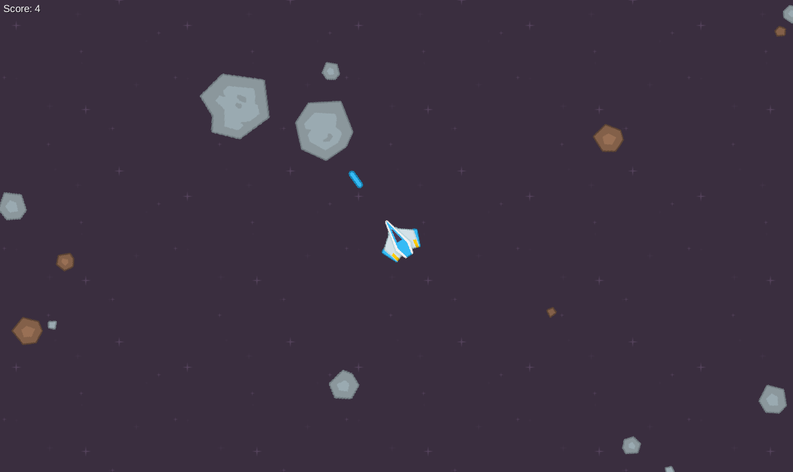

# Asteroids-LibGDX

1. При желании запустить готовый билд, Asteroids.jar находится в директории Asteroids\desktop\build\libs
При первом запуске возле jar файла создатся папка Config, в котором будут конфигурационные файлы для кастомизации

2. При желении запустить из IDE, нужно запустить desktop:other:run, либо через консоль  .\gradlew desktop:ru
В папке Config также есть те же файлы для конфигурирования.

После запуска игра сражу же начинается, где у игрока есть 3 секунды(можно настраивать), пока астеройды не наносят урона.
Управление согласно ТЗ. Стрельба на ЛКМ
При задевании астеройда, у игрока снова 3 секунды бессмертия.
Всё остальное согласно ТЗ, включая дополнительные механики